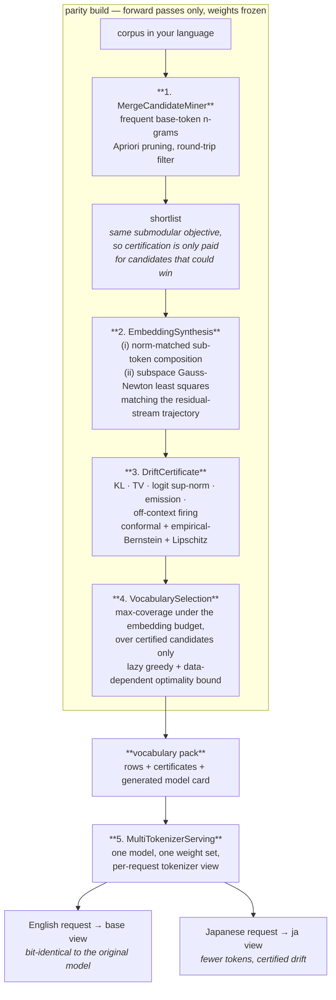
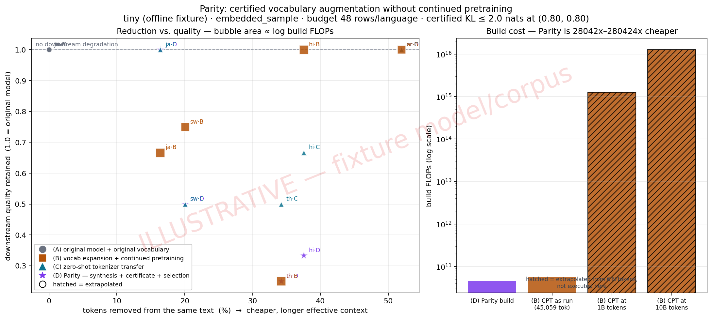

# Parity

[](https://github.com/NagaYu/parity/actions/workflows/ci.yml)
[](https://huggingface.co/spaces/NagaYu/parity)
[](https://huggingface.co/datasets/NagaYu/parity-fertility-atlas)
[](LICENSE)

**Your language costs more tokens to say the same thing. That is a property of the
tokenizer, not of your language — and it can be fixed without retraining the model.**

Parity adds language-specific tokens to an already-trained open-weight model, synthesises
their embeddings from the model's own internal representations, and ships a **certificate
bounding how far the model's behaviour can move**. No continued pretraining. English is
not merely preserved — it is bit-for-bit unchanged, by construction.

| | |
| --- | --- |
| **Token reduction** | measured on held-out text, per language |
| **Behaviour drift** | bounded, distribution-free, stated on every model card |
| **English / other languages** | **exactly** unchanged (append-only rows + per-request view mask) |
| **Build cost** | 2–3 orders of magnitude below continued pretraining |
| **Serving** | one model instance, many tokenizers, shared prefix cache |

```bash
pip install -e ".[all]"
parity demo --lang ja                 # whole pipeline, offline, ~3 seconds
parity build --model Qwen/Qwen2.5-0.5B-Instruct --lang ja --budget 8000
```

**Try it without installing anything:** the [Space](https://huggingface.co/spaces/NagaYu/parity)
tokenizes your own text in your browser and shows what it costs you.

---

## The problem, stated precisely

Hold *meaning* constant with a parallel corpus and count tokens. That ratio — what this
repository calls the **parity ratio** — is what a speaker actually experiences: how much
more of the context window their message consumes, and how much more it costs to send.

A ratio of 2.4 means 2.4x the price per message and 42% of the advertised context window.

Measured on OPUS-100 (`scripts/build_atlas.py`, full table in the
[Dataset](https://huggingface.co/datasets/NagaYu/parity-fertility-atlas)):

| language | Qwen2.5-0.5B | effective 128k window | SmolLM2-135M |
| --- | ---: | ---: | ---: |
| Burmese မြန်မာ | **7.70x** | 17k tokens (13%) | 13.51x |
| Tamil தமிழ் | **6.28x** | 20k (16%) | 9.57x |
| Telugu తెలుగు | **5.83x** | 22k (17%) | 10.04x |
| Bengali বাংলা | **5.10x** | 25k (20%) | 8.50x |
| Hindi हिन्दी | **4.27x** | 30k (23%) | 4.91x |
| Amharic አማርኛ | **3.77x** | 34k (27%) | 6.57x |
| Thai ไทย | **1.99x** | 64k (50%) | 6.23x |
| Japanese 日本語 | **1.22x** | 105k (82%) | 2.98x |
| Chinese 中文 | **0.92x** | 139k (109%) | 2.37x |
| English | 1.00x | 128k (100%) | 1.00x |

Two things this table makes hard to misread. Chinese costs Qwen2.5 *less* than
English — so this is not about scripts being dense or languages being long. And the
same language moves by 3–5x between two tokenizers of similar size. The variable is
the tokenizer's training corpus, and nothing else.

This is arithmetic about a tokenizer. A tokenizer is fitted to a corpus; the corpora used
to fit today's tokenizers under-represented most of the world's writing systems, and the
ratios are the consequence. **No language in this repository is described as inefficient,
verbose, or hard to model, because none of them is.** The artefact is what is broken, and
artefacts can be repaired. See [`docs/framing.md`](docs/framing.md) — it is a design
constraint on the code and the copy, not a disclaimer.

Measuring the problem is the easy part, and it is not the point of this project. The
implementation and the guarantee are.

## How it works



### 1. MergeCandidateMiner

Parity tokens are defined in **token-id space**, not string space: a new token is a
contiguous run of base-token ids, and encoding is `base_encode(text)` followed by one
leftmost-longest merge pass. Three properties follow, and all three are load-bearing:

- lossless round-trip for *any* base tokenizer (BPE, Unigram, WordPiece, byte-level) with
  no pre-tokenizer surgery;
- exact English non-regression, because ids are append-only;
- prefix-cache entries stay valid across views, because an id means the same thing
  everywhere.

### 2. EmbeddingSynthesis — the core

For a new token whose expansion is `v₁…v_k`, we want the model to end up in the same
internal state after reading one token as after reading `k`.

**(i)** Start from an inverse-frequency weighted combination of the sub-token embeddings,
rescaled to the norm typical of the embedding matrix. The rescaling is not cosmetic:
averaging `k` near-orthogonal vectors shrinks the norm by ~`1/√k`, which moves the vector
off the manifold the model's first RMSNorm was calibrated on.

**(ii)** Then minimise, over a handful of calibration contexts,

```
L(e) = Σ_c Σ_ℓ Σ_p ‖h_new[ℓ,p] − h_orig[ℓ,p]‖² / σ_ℓ²  +  λ‖e − e₀‖²
```

restricted to `e = e₀ + Bz` with `B ∈ ℝ^{d×q}`, `q ≈ 8`, spanned by the sub-token
embeddings, their mean, and top principal directions of the embedding matrix. In that
subspace the Gauss-Newton normal equations are `q × q` and solved in closed form; the
Jacobian comes from `q` finite-difference forward passes that are **batched across every
candidate in a chunk**, because each calibration sequence contains exactly one candidate.

So a chunk of `C` candidates costs `(q+1)·iters + 1` batched forward passes — about 9
instead of the `d ≈ 896` a full-dimensional Jacobian would need, and one batched call
instead of `C` sequential ones. Cost stays linear in the number of tokens built, but with
a small constant and a well-filled batch.

Damped, with an explicit accept/reject step: a token whose linearisation is poor keeps its
composition embedding rather than being made worse.

For untied models the unembedding row is a closed-form ridge regression anchored at the
first sub-token's output row. For **tied** models — Qwen2.5-0.5B, Llama-3.2-1B — there is
no second vector, so the emission target is folded into the input objective instead.

**Why this is not continued pretraining:** every model parameter is frozen, including
through the backward path. The only free variables are `q` numbers per token. There is no
LM loss and no corpus pass. A build touches a few thousand calibration tokens; continued
pretraining touches billions.

### 3. DriftCertificate

Measured on held-out contexts, **disjoint from the ones the embedding was fitted on**:

| statistic | what it catches |
| --- | --- |
| `kl_next_token`, `tv_next_token` | the model predicting something different after the merge |
| `logit_linf` | feeds the deterministic Lipschitz bound |
| `hidden_l2_rel` | residual-stream displacement |
| `emit_logprob_err` | the new token being *generated* with the wrong probability |
| `offcontext_mass` | the new token firing where it does not belong — including on English |

Three bound families, reported together because each answers a different question:

1. **Conformal upper tolerance limit** (the headline). From order statistics, no
   distributional assumption: *with probability ≥ 1−δ over the calibration draw, at least
   1−α of future inputs have drift ≤ B.* A statement about the tail, which is what users
   experience. The implementation reproduces the textbook 95/95 rule exactly — the sample
   maximum first qualifies at n = 59, and `binomial_tolerance_index` returns `None` below
   that rather than quietly using the max.
2. **Empirical-Bernstein** bound on the mean (Maurer & Pontil), with the clip rate
   reported, because a bound on a clipped statistic is a bound about the unclipped tail
   only if you say what fraction was clipped.
3. **Deterministic Lipschitz:** if two logit vectors differ by ≤ ε in sup-norm then
   `KL(softmax(z) ‖ softmax(z')) ≤ 2ε` (proof in the docstring), composed with
   `‖Δz‖_∞ ≤ max_i‖W_U[i]‖₂ · ‖Δh‖₂`.

**What is not claimed.** These are finite-sample, distribution-free bounds *with respect
to the calibration distribution*. They are not worst-case over all inputs. An adversarial
prompt, or a domain far from the calibration corpus, is outside the guarantee. Saying so
plainly is part of the deliverable: an overstated certificate transfers risk to the people
least able to detect it.

Tokens whose bound exceeds the tolerance are **not adopted** — and tokens without enough
held-out evidence to compute a bound are not adopted either. `parity build` prints which
of the two happened, because they call for opposite fixes.

### 4. VocabularySelection

Ranking by `count × (len − 1)` is wrong: candidates overlap, and only one can match at a
given position. Laying the corpus out as token slots, the tokens saved by a set `S` is a
**weighted maximum coverage** function over the internal boundaries each merge removes —
monotone and submodular, so lazy greedy (CELF) gives the classical `1 − 1/e`.

Three numbers are always reported, never one:

- `surrogate` — what the optimiser maximised (an *upper* bound on real savings);
- `exact_savings` — tokens actually removed by retokenising the corpus. **Every reduction
  figure in this repository is this one;**
- `online_bound` — `F(S) + Σ top-B marginal gains`, a data-dependent upper bound on the
  best pack of the same size. Dividing gives a **certified optimality ratio for this run**,
  usually far above the worst-case 0.632.

The ground set is certified candidates only, so the budget constrains *reduction subject to
a proven bound*.

### 5. MultiTokenizerServing

One model instance, one weight set, a tokenizer view chosen per request.

- **Views batch together.** Not "two models in a batch" — one model. Throughput is
  unchanged; the per-request cost is a tokenizer dispatch and a precomputed logit mask.
- **The prefix cache is not fragmented.** A KV entry is a function of the id prefix and the
  weights, both shared, so an entry produced under one view is numerically valid for a
  request under another. The cache counts these as `cross_view_hits`, and the test suite
  asserts the reused result is identical to a cold run.
- **English is exactly English.** A base-view request contains only base ids, hits only
  unmodified rows, and has every pack logit masked to −∞ before the softmax. Masked-softmax
  over the base subset *equals* the original softmax. This is an identity, and
  `tests/test_english_nonregression.py` asserts it numerically anyway.

Adapters for vLLM and TGI live in [`serving/`](serving/).

## Benchmark

Four conditions, sharing the **same selected token set** so the comparison isolates how the
embeddings were obtained:

| | condition | weights changed? | certificate? |
| --- | --- | :---: | :---: |
| **A** | original model, original vocabulary | — | — |
| **B** | vocabulary expansion + continued pretraining | **yes** | no |
| **C** | zero-shot tokenizer transfer (mean of sub-tokens) | no | no |
| **D** | **Parity** | no | **yes** |

```bash
python -m benchmarks.run --demo                                    # offline, ~1 min
python -m benchmarks.run --model Qwen/Qwen2.5-0.5B-Instruct \
    --langs ja,hi,ar,th,sw --budget 4000 --out runs/qwen05b
```

Metrics: (1) fertility reduction per language · (2) downstream retention, measured in
**bits per character** so it cannot be gamed by making tokens longer, plus a
translation-retrieval probe, plus the English columns · (3) re-measured drift inside the
certificate · (4) build cost against (B), itemised · (5) effective-context gain and
per-message cost reduction · (6) multi-tokenizer serving overhead.

### The figure



x = tokens removed, y = quality retained, bubble area ∝ log build FLOPs. (D) should sit in
the high-reduction / no-degradation corner with a small bubble, next to (B) in the same
corner with a bubble orders of magnitude larger. Any extrapolated point is **hatched**, and
a run on fixture data is watermarked ILLUSTRATIVE — inside the image, because a plot
travels further than its caption.

Regenerate: `python figures/make_pareto.py runs/latest/results.json figures/pareto.png`

### Corpora, and a gate that is not ours

Every metric here is computed on a **parallel** corpus, because comparing token
counts across languages only means something if meaning is held constant. The loader
tries three sources in order and records which one it used in every manifest and report:

| source | status | note |
| --- | --- | --- |
| **FLORES-200** | **gated** | preferred — fully aligned across all 200+ languages. Accept the terms on the [dataset page](https://huggingface.co/datasets/openlanguagedata/flores_plus) and `huggingface-cli login`. |
| **OPUS-100** | open | web-mined, so `parity.corpora.clean_bitext` drops misaligned pairs; the atlas prints the corpus ratio *and* the per-sentence median so surviving noise is visible. Aligned pairwise (each language against its own English side) — `ParallelCorpus.pivot_for` makes sure a Hindi sentence is never scored against a Japanese sentence's translation. Does not cover every language. |
| **embedded sample** | always | 24 hand-checked sentences in the repo. Enough for tests and the offline demo, never enough for a claim — reports that use it are watermarked. |

For a language none of these cover, supply your own:

```bash
export PARITY_PARALLEL_SW=/path/to/pairs.tsv   # target<TAB>english, one pair per line
export PARITY_MINING_CORPUS_SW=/path/to/monolingual.txt
```

Uncleaned OPUS-100 gave Arabic a parity ratio of **12.2x** against Qwen2.5's tokenizer;
after cleaning, **1.43x**, with the median agreeing. The first number was measuring
alignment noise. That is why the cleaning step exists and why both numbers are printed.

### An honest limit

The binding constraint on pack size is **calibration corpus size**, not compute. The
emission and off-context statistics produce one measurement per occurrence, and a (95%,
95%) tolerance limit needs 59 held-out occurrences of a token. FLORES-200's dev split
certifies only the few hundred most frequent candidates. An 8000-token pack needs a corpus
on the order of 10⁷ tokens; point the CLI at one with
`PARITY_MINING_CORPUS_JA=/path/to/corpus.txt`. Parity refuses under-evidenced tokens rather
than shipping them, so a small corpus yields a small pack, never a weak guarantee.

## Measured results

Everything below is measured, not projected. The build ran on CPU;
`runs/` holds the manifests.

### Fertility, and what a pack recovers

The atlas table above is the baseline. What Parity recovers from it is the part
that has to be earned, and here is what it actually earned.

### The drift study — SmolLM2-135M, Japanese

The interesting result of this project is a negative one, and it is worth more
than a flattering number would be.

Setup: OPUS-100 Japanese, 40 000 lines split four ways; 2 436 candidates mined
from 573 k tokens; a 96-candidate shortlist that covers **30.3%** of the corpus's
tokens (certified optimality ≥ 0.785 of the best shortlist that size).

| synthesis | median next-token KL | 95/95 tail bound (median) | best token |
| --- | ---: | ---: | ---: |
| composition only — condition (C) | 0.196 | 2.72 | 1.87 |
| subspace Gauss-Newton, `q=8`, 2 iters | 0.196 | 2.64 | 1.63 |
| subspace, `q=24`, 4 iters | 0.221 | 1.95 | 1.35 |
| **+ full-dimension refinement (`gn+adam`)** | **0.053** | **1.04** | **0.13** |

Two things follow, both of which changed the code:

1. **The subspace restriction was the binding constraint, not the iteration
   count.** Widening `q` from 8 to 24 and quadrupling iterations barely moved the
   bound; adding a full-dimension refinement cut the median KL by 5x. So
   `--solver gn+adam` is the recommended setting for real models, and the
   docstring on `_adam_refine` records these numbers rather than an intuition.
   The fixture model does *not* show this — its geometry is nearly linear in the
   embedding — which is why the default is documented from the real measurement.

2. **The certificate then refused almost everything.** At a 0.35-nat tolerance,
   **2 of 96** candidates were adopted: 83 refused for KL drift, 7 for total
   variation, 4 for off-context firing. The resulting pack saves 0.5% of tokens.

The two that survived are `か？` and `れる` — short, idiomatic, highly
predictable. The candidates with the *largest* raw saving are single high-frequency
particles (`た`, `は`, `か`), and they are the worst possible merges: maximal
contextual variability, so no single embedding reproduces the expansion across
contexts.

**What this means.** On a 135M English-centric model, aggressive byte-level
Japanese merges cannot be certified at a bar worth having. That is a real limit
of frozen-model vocabulary augmentation at this scale, and the certificate is
what surfaced it — a method without one would have shipped all 96 tokens and
reported a 30% saving. Two directions the study points at: models whose
target-language representations are already better structured (Qwen2.5 tokenizes
Japanese at 1.22x, so its internal Japanese is not byte soup), and merges chosen
for *predictability* rather than raw frequency.

Published pack: [`NagaYu/parity-ja-smollm2-135m`](https://huggingface.co/NagaYu/parity-ja-smollm2-135m)
— 2 tokens, certified KL ≤ 0.099 nats at (95%, 95%). It is published as a
demonstration of the artefact format and of this negative result, and its model
card says so.

### Cost

| | FLOPs | wall-clock |
| --- | ---: | ---: |
| Parity build (96 candidates, `gn+adam`) | 3.5e14 | 65 min, CPU |
| continued pretraining at 1B tokens, same model | 8.1e17 | — (extrapolated) |

**~2 300x cheaper** than the published-scale baseline. Synthesis dominates
(3 731 s); certification is 148 s, because the negative probe and the batched
measurement amortise across all candidates.

### Tied embeddings, and input-only packs

SmolLM2-135M ties its input and output embeddings, so one vector must both
reproduce the expansion's internal state *and* carry the right emission
probability — two objectives that do not generally have a common solution. Parity
handles this with an **input-only** pack (`--input-only`): pack tokens are
readable but masked out of the sampler, so emission drift is zero by
construction rather than bounded by measurement. Prompt tokens are where the
saving is, and generation continues to emit base tokens that decode to the same
strings.


## Use

```python
from parity import serving

router = serving.load("Qwen/Qwen2.5-0.5B-Instruct", packs=["your-org/parity-ja"])
router.encode("子どもたちが公園で遊んでいます。", view="ja")   # fewer tokens
router.encode("The children are playing.",        view="base") # the original tokenizer
```

## Scope — where this applies, and where it does not

**Applies to:** open-weight models, and to anyone serving them. Parity needs write access
to the embedding matrix.

**Does not apply to:** closed APIs. You cannot attach a pack to a model you can only reach
through someone else's endpoint. If you are a user of such an API, this repository can
measure what you are being charged; only the provider can fix it. That asymmetry is the
reason the atlas exists alongside the implementation, and the reason the implementation is
the larger half.

## Contributing a pack for your language

See [`docs/contributing-a-pack.md`](docs/contributing-a-pack.md). In short: point the CLI
at a corpus you trust, review the mined tokens — they are printed as strings, not ids —
and open a pull request with the pack. **Review of the token list by speakers of the
language is part of the process, not an optional extra.** A tokenizer that splits words in
places that make no sense to the people who use them is the problem this project started
from; reproducing it faster would not be progress.

## Repository

```
parity/            miner · synthesis · certificate · selection · serving · cli
benchmarks/        run.py · tasks.py · cost.py · report.py
serving/           vLLM and TGI adapters
scripts/           build_atlas.py · push_vocab_pack.py
figures/           make_pareto.py
tests/             109 tests, fully offline
app.py             Gradio app — the reference demo, run locally
space/             the published static Space (transformers.js, tokenizes in-browser)
```

The published Space is **static** rather than Gradio: Hugging Face hosts Gradio Spaces
only on paid hardware, and a demo that costs money to stay up is a demo that eventually
goes down. `space/index.html` tokenizes in the visitor's browser with transformers.js and
reads a pack's manifest straight from its Model repo, so it has no cold start and the
certificate it displays is the one that shipped. `app.py` is the same demo as a Gradio
app — run it locally with `python app.py`, or deploy it if you have paid Space hardware.

Every public function's docstring names which claim it substantiates —
`reduction` / `non-regression` / `bound` / `low-cost` / `infrastructure` — and
`tests/test_docstring_claims.py` fails the build if one is missing.

```bash
pip install -e ".[dev,models,bench]"
pytest -q                    # ~40s, no network, no downloads
```

## Citation

```bibtex
@software{parity2026,
  title  = {Parity: certified vocabulary augmentation without continued pretraining},
  year   = {2026},
  note   = {Research prototype},
  url    = {https://github.com/NagaYu/parity}
}
```

Apache-2.0. The embedded parallel sample in `data/` is CC0; FLORES-200 is CC BY-SA 4.0.
